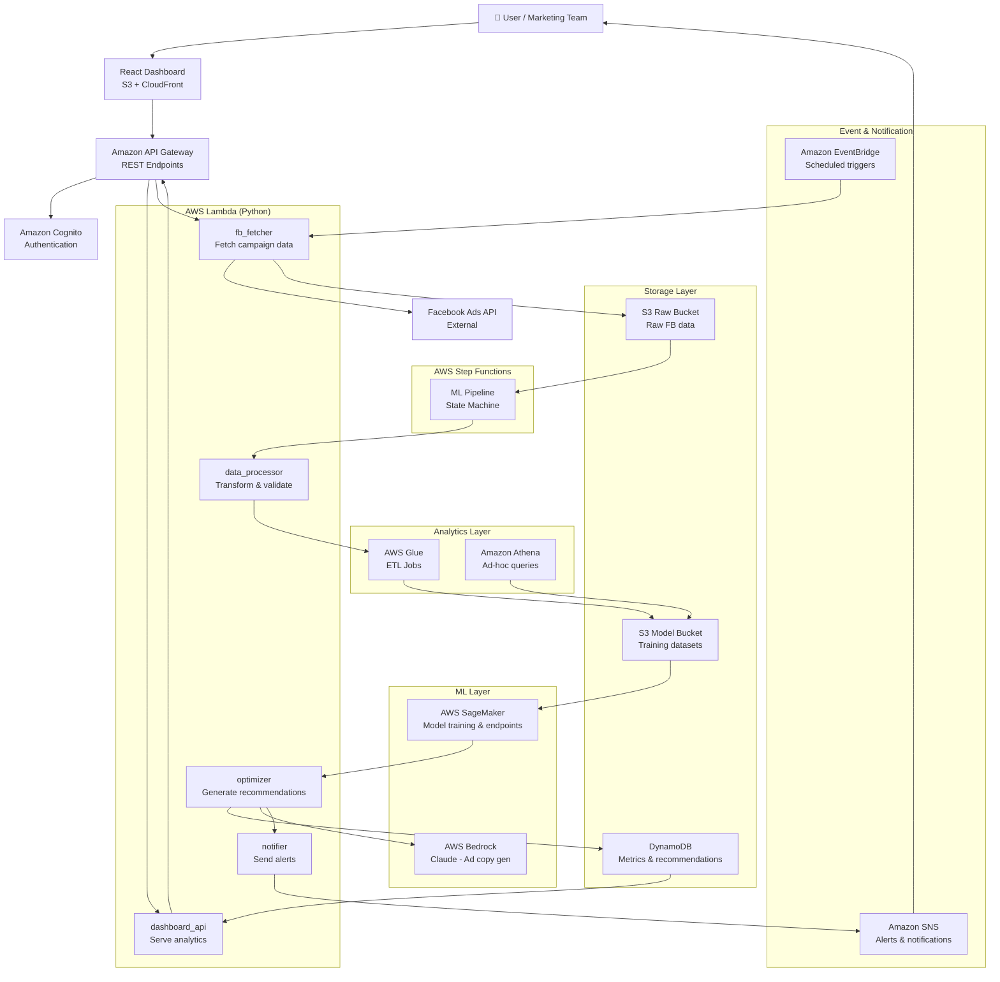
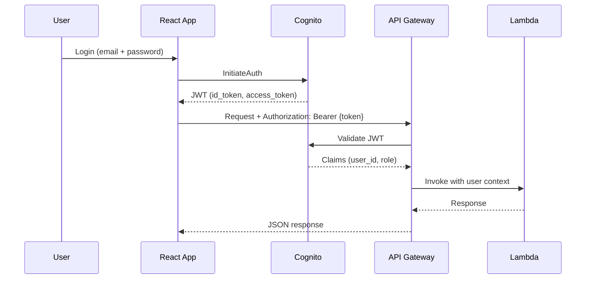

# Design Document: AI-Powered Facebook Campaign Optimization

## Overview

This system is a cloud-native, serverless platform that automatically fetches Facebook Ads performance data, runs AI/ML models to detect optimization opportunities, and delivers actionable recommendations (bid adjustments, audience refinements, budget reallocation) through a React dashboard. It extends the existing FastAPI/Lambda backend — which already integrates AWS Bedrock, Google Gemini, and OpenAI for ad copy generation — by adding a full campaign analytics and optimization pipeline built on AWS serverless services.

The platform is designed for marketing teams who want to reduce manual campaign management overhead. All compute is event-driven and auto-scaling; no servers are provisioned or managed. The ML pipeline (data ingestion → ETL → training → inference → recommendation) is orchestrated via AWS Step Functions, with results surfaced in real time through API Gateway and a CloudFront-hosted React frontend.

---

## Part 1: High-Level Design

### Architecture Overview




### Component Responsibilities

| Component | Role |
|---|---|
| React Dashboard | Campaign overview, KPI charts, recommendation cards, budget controls |
| API Gateway | Single entry point; JWT auth via Cognito authorizer; routes to Lambda |
| Amazon Cognito | User pools, role-based access (admin / analyst / viewer) |
| fb_fetcher Lambda | Calls Facebook Ads Insights API on schedule or on-demand; writes raw JSON to S3 |
| data_processor Lambda | Validates and normalizes raw data; triggers Glue ETL |
| AWS Glue | ETL: cleans, aggregates, and partitions campaign metrics into Parquet on S3 |
| Amazon Athena | SQL queries over processed S3 data for trend analysis |
| AWS Step Functions | Orchestrates the full ML pipeline: fetch → process → train/infer → recommend |
| AWS SageMaker | Hosts trained prediction models; exposes inference endpoints |
| optimizer Lambda | Calls SageMaker endpoint; generates bid/budget/audience recommendations |
| AWS Bedrock (Claude) | Generates human-readable ad copy suggestions (extends existing integration) |
| DynamoDB | Stores processed metrics, recommendations, user preferences, alert configs |
| SNS | Sends email/SMS alerts for budget threshold breaches and performance drops |
| EventBridge | Cron-based triggers for scheduled campaign data pulls (e.g., every 6 hours) |

### Data Flow

```mermaid
sequenceDiagram
    participant EB as EventBridge (cron)
    participant FB_L as fb_fetcher Lambda
    participant FB as Facebook Ads API
    participant S3 as S3 Raw Bucket
    participant SF as Step Functions
    participant Glue as AWS Glue
    participant SM as SageMaker
    participant OPT as optimizer Lambda
    participant DDB as DynamoDB
    participant SNS as SNS
    participant DASH as Dashboard API Lambda
    participant UI as React Dashboard

    EB->>FB_L: Trigger (every 6h)
    FB_L->>FB: GET /insights (campaigns, adsets, ads)
    FB-->>FB_L: Raw metrics JSON
    FB_L->>S3: PUT raw/{date}/{campaign_id}.json
    S3->>SF: S3 event triggers pipeline
    SF->>Glue: Start ETL job
    Glue->>S3: Write processed Parquet
    SF->>SM: Invoke prediction endpoint
    SM-->>SF: Predicted CTR, CPC, ROAS
    SF->>OPT: Pass predictions + raw metrics
    OPT->>DDB: Write recommendations
    OPT->>SNS: Publish alert if threshold breached
    UI->>DASH: GET /dashboard/campaigns
    DASH->>DDB: Query metrics + recommendations
    DASH-->>UI: JSON response
```

### User Authentication Flow



### Security Model

- All API endpoints protected by Cognito JWT authorizer on API Gateway
- Lambda functions use least-privilege IAM roles (separate role per function)
- S3 buckets: server-side encryption (SSE-S3), no public access
- DynamoDB: encryption at rest enabled
- Facebook API tokens stored in AWS Secrets Manager; never in code or env vars
- HTTPS enforced on CloudFront and API Gateway
- VPC not required (serverless); SageMaker endpoints in private subnet if needed

### Scalability & Availability

- All compute is Lambda (auto-scales to concurrency limits; provisioned concurrency for optimizer)
- DynamoDB on-demand capacity mode — scales with traffic automatically
- SageMaker endpoint: auto-scaling policy based on invocation count
- CloudFront CDN for frontend — global edge caching
- Target: 99.9% uptime via multi-AZ Lambda + DynamoDB

---

## Part 2: Low-Level Design

### Core Data Models

```python
# backend/models/ad_models.py (extended)

from pydantic import BaseModel, Field
from typing import Optional, List
from enum import Enum

class OptimizationGoal(str, Enum):
    CTR = "CTR"
    CPC = "CPC"
    CONVERSION = "CONVERSION"
    ROAS = "ROAS"

class CampaignMetrics(BaseModel):
    campaign_id: str
    campaign_name: str
    date: str                          # ISO 8601 YYYY-MM-DD
    impressions: int
    clicks: int
    spend: float                       # USD
    conversions: int
    ctr: float                         # clicks / impressions
    cpc: float                         # spend / clicks
    roas: float                        # revenue / spend
    reach: int
    frequency: float

class Recommendation(BaseModel):
    recommendation_id: str
    campaign_id: str
    generated_at: str                  # ISO 8601 timestamp
    goal: OptimizationGoal
    action: str                        # e.g. "increase_bid", "narrow_audience"
    current_value: float
    suggested_value: float
    confidence_score: float            # 0.0 - 1.0
    reasoning: str
    applied: bool = False

class AlertConfig(BaseModel):
    user_id: str
    campaign_id: str
    metric: str                        # e.g. "ctr", "spend"
    threshold: float
    direction: str                     # "below" | "above"
    sns_topic_arn: str

class AdRequest(BaseModel):
    business: str
    location: str
    goal: str
    # Extended from existing model
    campaign_id: Optional[str] = None
    optimization_goal: Optional[OptimizationGoal] = None
```

### Key Functions with Formal Specifications

#### fb_fetcher Lambda — `fetch_campaign_metrics()`

```python
def fetch_campaign_metrics(
    account_id: str,
    date_range: dict,          # {"since": "YYYY-MM-DD", "until": "YYYY-MM-DD"}
    access_token: str
) -> list[dict]:
    ...
```

**Preconditions:**
- `account_id` is a non-empty string matching pattern `act_\d+`
- `date_range["since"] <= date_range["until"]`
- `access_token` is a valid, non-expired Facebook user access token
- Facebook Ads API is reachable

**Postconditions:**
- Returns list of raw metric dicts; may be empty if no campaigns exist
- Each dict contains keys: `campaign_id`, `impressions`, `clicks`, `spend`, `date_start`, `date_stop`
- On API error: raises `FacebookAPIError` with status code and message
- Raw JSON written to `s3://raw-bucket/raw/{date}/{account_id}.json`

**Loop Invariants:**
- Pagination cursor advances on each iteration; all previously fetched pages remain in result list
- Total records accumulated is monotonically non-decreasing

---

#### data_processor Lambda — `normalize_metrics()`

```python
def normalize_metrics(raw_records: list[dict]) -> list[CampaignMetrics]:
    ...
```

**Preconditions:**
- `raw_records` is a non-empty list
- Each record contains at minimum: `campaign_id`, `impressions`, `clicks`, `spend`

**Postconditions:**
- Returns list of `CampaignMetrics` with all derived fields computed
- `ctr = clicks / impressions` (0.0 if impressions == 0)
- `cpc = spend / clicks` (0.0 if clicks == 0)
- Records with missing required fields are logged and excluded (not raised)
- Output length <= input length

**Loop Invariants:**
- For each processed record: all required fields are present and type-valid
- Invalid records counter is monotonically non-decreasing

---

#### optimizer Lambda — `generate_recommendations()`

```python
def generate_recommendations(
    metrics: list[CampaignMetrics],
    predictions: dict,             # SageMaker inference output
    goal: OptimizationGoal
) -> list[Recommendation]:
    ...
```

**Preconditions:**
- `metrics` is non-empty
- `predictions` contains keys: `predicted_ctr`, `predicted_cpc`, `predicted_roas`
- `goal` is a valid `OptimizationGoal` enum value
- All `confidence_score` values in predictions are in range [0.0, 1.0]

**Postconditions:**
- Returns one `Recommendation` per campaign in `metrics`
- Each recommendation's `confidence_score` is in [0.0, 1.0]
- `suggested_value` differs from `current_value` by at most 50% (guardrail)
- Recommendations with `confidence_score < 0.6` are flagged as low-confidence in `reasoning`
- All recommendations written to DynamoDB table `Recommendations`

**Loop Invariants:**
- For each campaign processed: exactly one recommendation is generated
- DynamoDB write failures are retried up to 3 times with exponential backoff

---

### Algorithmic Pseudocode

#### ML Pipeline State Machine (Step Functions)

```pascal
ALGORITHM run_ml_pipeline(s3_event)
INPUT: s3_event containing bucket and key of newly uploaded raw data
OUTPUT: recommendations written to DynamoDB, alerts sent via SNS

BEGIN
  // Step 1: Validate trigger
  raw_key ← s3_event.key
  ASSERT raw_key STARTS WITH "raw/"

  // Step 2: Normalize data
  raw_records ← s3.get_object(raw_key)
  metrics ← normalize_metrics(raw_records)
  ASSERT LENGTH(metrics) > 0

  // Step 3: Run ETL
  glue_job_id ← glue.start_job_run("campaign_etl", metrics)
  WAIT UNTIL glue_job_status(glue_job_id) IN {SUCCEEDED, FAILED}
  IF glue_job_status = FAILED THEN
    RAISE GlueETLError("ETL job failed")
  END IF

  // Step 4: Invoke SageMaker prediction
  FOR each campaign IN metrics DO
    ASSERT campaign.campaign_id IS NOT NULL
    feature_vector ← build_feature_vector(campaign)
    prediction ← sagemaker.invoke_endpoint("campaign-optimizer", feature_vector)
    predictions[campaign.campaign_id] ← prediction
  END FOR

  // Step 5: Generate recommendations
  goal ← fetch_campaign_goal(metrics[0].campaign_id)
  recommendations ← generate_recommendations(metrics, predictions, goal)
  ASSERT LENGTH(recommendations) = LENGTH(metrics)

  // Step 6: Persist and notify
  FOR each rec IN recommendations DO
    dynamodb.put_item("Recommendations", rec)
    IF rec.confidence_score >= 0.6 THEN
      check_and_alert(rec)
    END IF
  END FOR

  RETURN recommendations
END
```

#### Alert Threshold Check

```pascal
ALGORITHM check_and_alert(recommendation, alert_configs)
INPUT: recommendation of type Recommendation
       alert_configs: list of AlertConfig for this campaign
OUTPUT: SNS notification published if threshold breached

BEGIN
  FOR each config IN alert_configs DO
    current ← get_current_metric(recommendation.campaign_id, config.metric)

    IF config.direction = "below" AND current < config.threshold THEN
      message ← build_alert_message(config, current, recommendation)
      sns.publish(config.sns_topic_arn, message)
    END IF

    IF config.direction = "above" AND current > config.threshold THEN
      message ← build_alert_message(config, current, recommendation)
      sns.publish(config.sns_topic_arn, message)
    END IF
  END FOR
END
```

#### Facebook Data Fetch with Pagination

```pascal
ALGORITHM fetch_campaign_metrics(account_id, date_range, access_token)
INPUT: account_id: String, date_range: {since, until}, access_token: String
OUTPUT: all_records: list of raw metric dicts

BEGIN
  all_records ← []
  cursor ← null

  REPEAT
    // LOOP INVARIANT: all_records contains all records from pages fetched so far
    ASSERT (cursor = null) OR (cursor IS valid pagination cursor)

    response ← facebook_api.get_insights(
      account_id, date_range, access_token, after=cursor
    )

    all_records ← all_records + response.data
    cursor ← response.paging.cursors.after

  UNTIL response.paging.next IS NULL

  ASSERT LENGTH(all_records) >= 0
  RETURN all_records
END
```

### Lambda Function Map

```python
# backend/integrations/fb_client.py
def get_insights(account_id, date_range, access_token, fields, after=None) -> dict: ...
def apply_recommendation(campaign_id, update_payload, access_token) -> bool: ...

# backend/services/campaign_fetcher.py  (new)
def fetch_and_store(account_id: str, date_range: dict) -> str: ...  # returns S3 key

# backend/services/data_processor.py   (new)
def normalize_metrics(raw_records: list[dict]) -> list[CampaignMetrics]: ...
def build_feature_vector(metrics: CampaignMetrics) -> list[float]: ...

# backend/services/optimizer.py        (new)
def generate_recommendations(metrics, predictions, goal) -> list[Recommendation]: ...
def check_and_alert(rec: Recommendation, configs: list[AlertConfig]) -> None: ...

# backend/services/ai_engine.py        (extend existing)
def generate_ad(business, location, goal) -> str: ...          # existing Gemini
def generate_ad_copy_from_recommendation(rec: Recommendation) -> str: ...  # new Bedrock
```

### DynamoDB Table Schemas

```
Table: CampaignMetrics
  PK: campaign_id (String)
  SK: date (String)  -- YYYY-MM-DD
  Attributes: impressions, clicks, spend, conversions, ctr, cpc, roas, reach, frequency
  GSI: date-index (PK: date) -- for date-range queries

Table: Recommendations
  PK: campaign_id (String)
  SK: generated_at (String)  -- ISO timestamp
  Attributes: recommendation_id, goal, action, current_value, suggested_value,
              confidence_score, reasoning, applied
  GSI: applied-index (PK: applied, SK: generated_at)

Table: AlertConfigs
  PK: user_id (String)
  SK: campaign_id#metric (String)
  Attributes: threshold, direction, sns_topic_arn

Table: Users
  PK: user_id (String)
  Attributes: email, role (admin|analyst|viewer), fb_account_id, created_at
```

### API Endpoints

```
POST   /auth/login                    → Cognito token exchange
GET    /campaigns                     → List all campaigns with latest metrics
GET    /campaigns/{id}/metrics        → Time-series metrics for a campaign
GET    /campaigns/{id}/recommendations → Latest recommendations
POST   /campaigns/{id}/apply          → Apply a recommendation to Facebook
POST   /campaigns/fetch               → Trigger on-demand data fetch
GET    /dashboard/summary             → Aggregated KPIs across all campaigns
POST   /generate-ad                   → Generate ad copy (existing, extended)
POST   /generate-strategy             → Generate marketing strategy (existing)
GET    /alerts                        → List alert configs for current user
POST   /alerts                        → Create/update alert config
```

### Correctness Properties

*A property is a characteristic or behavior that should hold true across all valid executions of a system — essentially, a formal statement about what the system should do. Properties serve as the bridge between human-readable specifications and machine-verifiable correctness guarantees.*

---

### Property 1: CTR is always in [0, 1]

*For any* list of raw campaign records with non-negative impressions and clicks values, every `CampaignMetrics` object produced by `normalize_metrics()` must have a `ctr` value in the closed interval [0.0, 1.0].

**Validates: Requirements 3.4**

---

### Property 2: CPC is non-negative for any valid spend and clicks

*For any* raw campaign record with non-negative `spend` and `clicks` values, the `cpc` field computed by `normalize_metrics()` must be greater than or equal to 0.0, and must be 0.0 when `clicks == 0`.

**Validates: Requirements 3.5**

---

### Property 3: Recommendation count equals input campaign count

*For any* non-empty list of `CampaignMetrics` objects and any valid `OptimizationGoal`, calling `generate_recommendations()` must return a list whose length equals the length of the input metrics list.

**Validates: Requirements 5.1**

---

### Property 4: Suggested value stays within 50% of current value

*For any* `Recommendation` produced by `generate_recommendations()`, the absolute relative deviation of `suggested_value` from `current_value` must not exceed 0.5 (i.e., `abs(suggested_value - current_value) / max(current_value, 0.01) <= 0.5`).

**Validates: Requirements 5.2**

---

### Property 5: Confidence score is always in [0, 1]

*For any* `Recommendation` produced by `generate_recommendations()` for any valid input metrics and predictions, the `confidence_score` field must be in the closed interval [0.0, 1.0].

**Validates: Requirements 5.3**

---

### Property 6: Pagination completeness — no data loss

*For any* Facebook Ads account with N total campaign records distributed across any number of paginated API response pages, `fetch_campaign_metrics()` must return exactly N records in total.

**Validates: Requirements 2.4**

---

### Property 7: Normalization is idempotent on valid input

*For any* list of valid raw records, applying `normalize_metrics()` twice (re-normalizing already-normalized output) must produce a result equivalent to applying it once.

**Validates: Requirements 3.3**

---

### Property 8: Invalid records are excluded, not raised

*For any* list of raw records where some records are missing required fields (`campaign_id`, `impressions`, `clicks`, `spend`), `normalize_metrics()` must return only the valid records without raising an exception, and the output length must be less than or equal to the input length.

**Validates: Requirements 3.6**

---

### Property 9: Low-confidence recommendations are flagged

*For any* `Recommendation` with `confidence_score < 0.6`, the `reasoning` field must contain a low-confidence indicator string.

**Validates: Requirements 5.4**

---

### Property 10: Recommendations round-trip through DynamoDB

*For any* list of recommendations written to DynamoDB by `generate_recommendations()`, querying `GET /campaigns/{id}/recommendations` must return recommendations containing the same `recommendation_id`, `action`, `suggested_value`, and `confidence_score` values that were written.

**Validates: Requirements 5.5, 5.7**

---

### Property 11: Alert configs round-trip through DynamoDB

*For any* `AlertConfig` created via `POST /alerts`, calling `GET /alerts` with the same authenticated user must return a list that includes a config matching the same `campaign_id`, `metric`, `threshold`, and `direction`.

**Validates: Requirements 7.1, 7.2**

---

### Property 12: Alert fires exactly when threshold is breached

*For any* `AlertConfig` and any current metric value, the notifier must publish to SNS if and only if the threshold condition is satisfied (value < threshold for `direction = "below"`, or value > threshold for `direction = "above"`).

**Validates: Requirements 7.4, 7.5**

---

### Property 13: Unauthenticated and invalid requests always return 401

*For any* API request that either carries no JWT, carries a malformed JWT, or carries an expired JWT, the API must return HTTP 401 and must not invoke any Lambda function or return any data.

**Validates: Requirements 1.2, 1.3, 1.8**

---

### Property 14: Role-based access control is enforced for all endpoints

*For any* API request carrying a valid JWT, the set of endpoints the request is permitted to access must be exactly the set defined for the role claim in that JWT (Viewer: read-only; Analyst: read + write campaigns/recommendations/alerts; Admin: all endpoints).

**Validates: Requirements 1.4, 1.5, 1.6, 1.7**

---

### Property 15: Required campaign fields are always present in fetched data

*For any* successful response from `fetch_campaign_metrics()`, every record in the returned list must contain all required fields: `campaign_id`, `impressions`, `clicks`, `spend`, `date_start`, `date_stop`.

**Validates: Requirements 2.8**

### Error Handling

| Scenario | Handler | Recovery |
|---|---|---|
| Facebook API rate limit (429) | fb_fetcher Lambda | Exponential backoff, max 5 retries; dead-letter to SQS |
| Facebook token expired | fb_fetcher Lambda | Publish SNS alert to admin; halt pipeline |
| Glue ETL job failure | Step Functions catch | Retry once; on second failure notify via SNS |
| SageMaker endpoint timeout | optimizer Lambda | Fall back to rule-based recommendations; log to CloudWatch |
| DynamoDB write throttle | optimizer Lambda | Retry with backoff (boto3 built-in); alert if persistent |
| Invalid campaign metrics (div/0) | data_processor | Set derived field to 0.0; log warning; continue processing |
| Cognito token invalid | API Gateway | Return 401; client redirects to login |

### Testing Strategy

**Unit Testing** (pytest)
- `test_normalize_metrics`: valid input, missing fields, zero impressions/clicks
- `test_generate_recommendations`: various goal types, low-confidence cases, guardrail enforcement
- `test_fetch_campaign_metrics`: mock Facebook API responses, pagination, error codes
- `test_check_and_alert`: threshold above/below, no matching config

**Property-Based Testing** (Hypothesis)
- CTR always in [0, 1] for any non-negative impressions/clicks
- Recommendation count always equals input metrics count
- Confidence score always in [0, 1] for any prediction input
- Suggested value never exceeds 50% deviation from current value

**Integration Testing** (pytest + moto for AWS mocks)
- Full pipeline: S3 upload → Step Functions → DynamoDB write
- API Gateway → Lambda → DynamoDB round-trip
- Facebook API mock → fb_fetcher → S3 storage

### Dependencies

| Package | Purpose |
|---|---|
| `boto3` | AWS SDK (Lambda, S3, DynamoDB, SageMaker, SNS, Step Functions) |
| `facebook-business` | Facebook Ads Insights API client |
| `fastapi` | Existing API framework |
| `pydantic` | Data validation and models |
| `google-genai` | Gemini AI (existing ad copy generation) |
| `openai` | GPT-4o strategy generation (existing) |
| `hypothesis` | Property-based testing |
| `pytest` / `moto` | Unit and integration testing with AWS mocks |
| `aws-cdk-lib` | Infrastructure as Code for deployment |

AI Simplified Insights (Bedrock)

The system leverages AWS Bedrock (Claude) to translate technical campaign metrics (CTR, CPC, ROAS) into simple, human-readable insights. This enables non-technical users such as small business owners to understand performance and take action without requiring marketing expertise.

2️⃣ Rule-Based Fallback System

In case the SageMaker model is unavailable or returns low-confidence predictions, the system falls back to a rule-based optimization engine. This ensures continuous functionality and reliability by applying predefined marketing heuristics (e.g., low CTR → improve creatives, high CPC → adjust bids).

3️⃣ Lightweight Mode

A lightweight execution mode is provided for small-scale users where the system bypasses heavy ML components (Glue, SageMaker) and uses rule-based logic combined with Bedrock for recommendations. This reduces cost and latency while maintaining essential functionality.

4️⃣ Cost Optimization Strategy

The system incorporates cost control mechanisms including:

Controlled Bedrock token usage
Scheduled data fetching via EventBridge (every 6 hours)
DynamoDB TTL for old data cleanup
Selective invocation of ML models only when required
These strategies ensure efficient operation within budget constraints.
5️⃣ Demo Mode

A demo mode is implemented to allow system testing without live Facebook API integration. Preloaded sample datasets simulate campaign performance, enabling demonstration of analytics, recommendations, and dashboard features in offline or restricted environments.